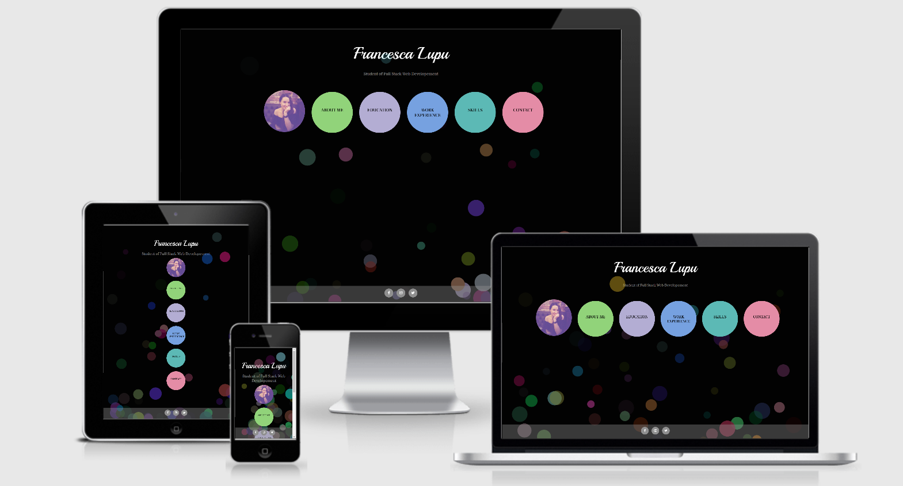
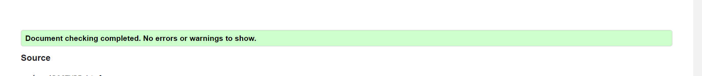
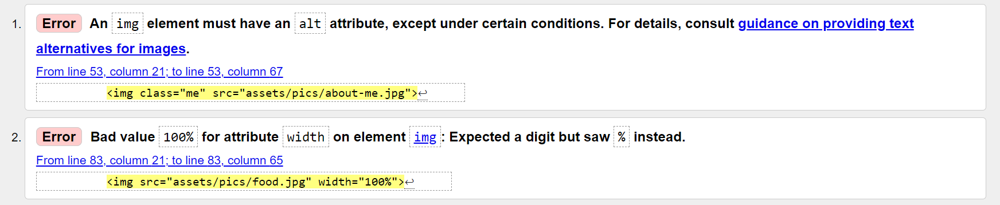
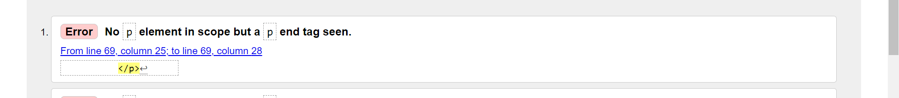
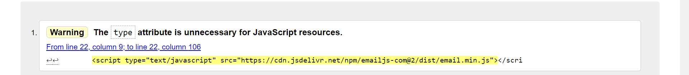
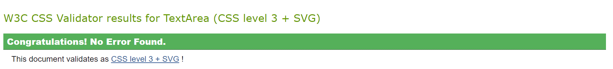
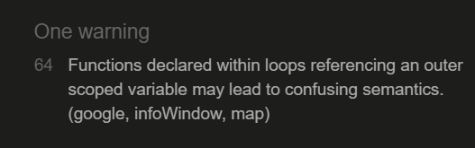

# ReadMe - My resume
----------------------

This website is been created to display my resume.
Its scope is to provide to possible employers a better experience than the one given by a Curriculum Vitae
printed on a sheet of paper.

You can visit my resume by clicking [here](https://fral96.github.io/Milestone-2/).

--------------------------------------------------------------------------------------------------------------------------------------
## 1. UX

### 1.1 Project goals

This resume website is been designed to help both potential employers and myself.

The idea is that an employer with a vacant position in his company could view my website
and get an idea about me and about my coding skills (at least enough to convince him to contact me).

This will certainly also be a big help for myself as it could be a useful tool in getting an employment in this field.

In fact, in my opinion in looking for a position in such creative work field, is needed something more creative than a simple printed resume.

----------------------------------------------------------------------------------------------------------------------------------------------

### 1.2 User stories

#### General

* As a moderator I want visitors and potential employers to view my resume, so they can understand more about me and possibly offer me a job.
* As a visitor I want to understand more about the moderator so I can appreciate if she can be the right person for my vacant place.
* As a moderator, I want my website to be easily accessible, that's why I will make it responsive for a large range of devices.
* As a visitor, I want to be able to view the moderator's website/resume even if I am on the go, that's why I want it to be possible to accede from my smartphone or tablet, besides my pc.
* As a moderator I want the visitor to feel like he/she knows a bit about me so I will provide access to my personal social media.
* As a visitor I want to browse through the moderator’s website so I can get an idea about both her skills and her personality.

#### Homepage

* As a moderator I want my webpage to be eye catching but still be simple and clean so it will impress and attract the visitor. 
* As a visitor I want to be attracted by the design first so I will be more persuaded to look into the website.
* As a moderator I want my website to be easy to consult so I will provide the visitor with an intuitive navigation menu to allow him/her to access the various areas.
* As a visitor I want to easily browse between the website sections that’s why I want the menu to be simple functional.

#### About me

* As a moderator I want the visitors to understand who I am that is why I will provide this section with a picture of me and an introduction.
* As a visitor is nice to put a face to a name that is why I would like to see a picture and read a few lines about her in order to know who I am reading about.
* As a moderator I want the visitor to know, besides professional information about me, also something more personal, that is why I want to add to my intro some of my hobbies.
* As a visitor I want to have a little but global knowledge about the person I am considering for my vacant position, for this motivation I would also like to know what her passions and her interests are.

#### Education

* As a moderator I want the visitors to easily see on a map the places where I studied so that they can understand more about my background.
* As a visitor I want to easily see where the moderator got her education and built her skills so I can have more details about her and her studies.
* As a moderator I want the visitor to be able to get all the necessary information about where I got my eduaction; for this reason I will provide phone number and address for each of the places.
* As a visitor I want to have access to some details on the places where the moderator studied in case I would need to contact them for references.

#### Work Experience

* As a moderator I want to display all my working experiences on a map so that the visitor will see at a glance all the places I worked before.
* As a visitor and possible future employer, I want to see where the moderator worked before as I can get an idea of her background and experiences.
* As a moderator, I want the visitors to be able to get information about the places I worked, that's why I will provide every place with some extra details.
* As a visitor, if I read about a place that I am not familiar with I would like to be able to check it out; that's why I would like to have some extra information about the moderators previous work places.

#### Skills

* As a moderator I want the visitors and possible future employer to know my strength points that is why I want to introduce and explain my top 6 skills.
* As a visitor and possible future employer I am looking for a person with a specific range of skills and this section will help me understand if they match the ones of the moderator.

#### Contact me

* As a moderator I want to give the possibility to all visitors to easily contact me in case they want to work with me or if they have questions about my resume; that is why in this section I want to add a contact form.
* As a visitor, if I enjoyed the moderator resume, I want to be able to easily contact her to schedule a meeting for example; for this reason I would need a contact feature.

-------------------------------------------------------------------------------------------------------------------------------------------------------

### 1.2 Wireframes

The wireframes for this project were designed on Balsamiq.
Click on the following link to view them.

* [Desktop](./assets/wireframes/desktop-wireframe.pdf)
* [Tablet](./assets/wireframes/tablet-wireframe.pdf)
* [Mobile](./assets/wireframes/mobile-wireframe.pdf)

------------------------------------------

## 2.Features

### 2.1 Present Features

* Navigation menu: In the homepage the links to the pages are in some colored circles.
The first one, with a picture of mine in it contains the link to the home,
the other ones contain the name and link to the other pages and are of the color of the page they represent.
When hovering on them the text "bounces in" and gets white.
The navigation menu changes in the other pages and it becomes a line on top of the screen with the names (and links) to the other pages.
When you are for example in the "About me" page, the name of the page in the navigation menu with become white.
This menu transforms in a collapsable hamburger menu on mobile devices.

* Homepage background: The background of the homepage is been created with Javascript and is black with some colored circles jumping around.
When hovering on one of these circles, they grow.
This background is been chosen to match the navigation menu of the homepage. The background jumping circles have a 50% opacity in order to don't distract from the menu ones.

* Footer: The footer is located on the bottom of every page. It is semy-transparent and it includes the links to my [Facebook](https://www.facebook.com/), [Instagram](https://www.instagram.com/) and [Twitter](https://www.twitter.com/) pages.
The icons of the social networks are located into small grey circles that become black when hovering on them.

* About me: In this page is displayed a picture of me on the left that scrolls down when the page is being scrolled.
On the right instead there is an inctroduction text about myself. At its bottom there are some pictures of my favorite hobbies displayed into ovals.
Underneath every picture there is a card with a little text about each of them.

* My Education: In this page, on the top is displayed a map from [GoogleMaps](https://www.google.com/maps) with some markers representing the last 3 places where I studied.
When clicking on a marker, an infowindow will open and will display the name, type, address and phone number of each place.
The markers contain some letters (A, B and C) and those are to connect them to the text located underneath the map.
There is a little text for each location with the name, location, date I studied there and the title I got after completing the studies.

* My Work Experience: This page is very similar to the previous. The only differences are that this time on the map are represented my previous employment places.
These markers also contain letters to connect them to the texts under the map. In these texts this time there are also little lists with the tasks I had when working in that specific place.

* My Skills: In the skills page I listed my top 6 skills. In order to identify them better and improve the design, on top of each skill there is an icon that represents it.

* Contact me: In this page the visitors of the website can contact me. There is a form and filling up name, email address and message (and pressing "Submit") I will receive the message on my email.
The form has some validation requirements: the name has to be filled in, the email address will be valid just if all the jQuery requirements are met and the message has to be long at least 10 characters.
After all the requirements are met and the "Send" button is been pressed an alert will inform the visitor if the message is been sent or not.
If the message is been sent correctly the form will be cleared after pressing "OK" on the alert. 

---------------------------------------------------------------------------------------------------------------------------

### 2.2 Future Features

* 
* 
* 

------------------------------------------------------------------------------------

## 3. Technologies used

* [HTML5](https://en.wikipedia.org/wiki/HTML5) - used to write the code for the website.
* [CSS3](https://en.wikipedia.org/wiki/CSS) - used to style the website.
* [JavaScript](https://en.wikipedia.org/wiki/JavaScript) - used to add interactive elements to the website.
* [JQuery](https://jquery.com/) - used to add interactive features.
* [Balsamiq](https://balsamiq.com/) - used to design the wireframes.
* [Gitpod](https://www.gitpod.io/) - used to design and host the project.
* [GitHub](https://github.com/) - used to hold the repository and deploy the project (GitHub Pages).
* [Bootstrap](https://getbootstrap.com/) - used to create the structure of the website.
* [Googlefonts](https://fonts.google.com/) - used for the website's fonts.
* [GoogleCloudPlatform](https://en.wikipedia.org/wiki/Google_Cloud_Platform) - used to add the maps.
* [AmIResponsive](http://ami.responsivedesign.is/#) - used for the READ ME picture.
* [Fontawesome](https://fontawesome.com/) - used for the icons.
* [JSEmail](https://www.emailjs.com/) - used to connect the form to my email.

-----------------------------------------------------------

### 4.Testing

#### Code Validators

##### HTML files with [W3C](https://validator.w3.org/) :

* The index.html file passed the validator test.

* The about-me.html file had 2 errors at first: I forgot to add the alt attribute to the images and I set their width to "100%" instead of to "100"(these errors were repeted for each image).
Once I corrected that, the file passed the validator test.

* The education.html file passed the validator test.

* The work-experience.html file had 1 error at first: the W3C said that a closing paragraph tag was found but not an opening one (this error was repeted 3 times).
The opening paragraph tag was actually there but I think the error was created by the fact that I placed an unordered list inside the paragraph.
Once I moved the unordered list out of the paragraph the error disappeared.

* The skills.html file passed the validator test.

* The contact.html file had 1 warning: In the snippet from EmailJS that connects the form to my email, insite the script tag there was also a type attribute (this error was found 2 times).
I removed it and luckily the error disappeared and the form was still working correctly.

##### CSS files with [W3C](https://jigsaw.w3.org/css-validator/#validate_by_input) :

* The style.css file passed the validator test.
* The responsive-style.css file passed the validator test.

#### JS files with [JSHint](https://jshint.com/) :

* The form.js file passed the validator without errors.

* The home.js file passed the validator without errors.

* The map-edu.js file passed the validator without errors. It only had one warning. I decided to don't modify anything about.

* The map-we.js file passed the validator without errors. It only had a warning. I decided to don't modify anything about.

-------------------------------------------------------------

#### Responsiveness

To test the responsiveness of the website I used [DevTools](https://developers.google.com/web/tools/chrome-devtools).
To check the devices where it was better supported instead, I used [Responsive Design Checker](https://www.responsivedesignchecker.com/).
The website is been also tested on my personal devices.

Below in the table you can find some examples of the devices where the website looks good and all features work well.

Mobile | Tablet | Desktop
-------|--------|--------
Iphone 3 to X | Ipad 8th Gen. | 19" to 24" desktop
Samsung Galaxy S5-S6-S7 | Ipad Pro | 10" to 15" notebook
Google Pixel| Ipad Mini |
Huawei P Smart | Amazon Kindle Fire

-----------------------------------------------------------------------------------------

The website was also tested in the following browsers:

* [Chrome](https://www.google.com/intl/en_ie/chrome/)
* [Safary](https://www.apple.com/safari/)
* [Opera](https://www.opera.com/)
* [Firefox](https://www.mozilla.org/en-US/firefox/new/)
* [Internet Explorer](https://www.microsoft.com/en-ie/download/details.aspx?id=41628)
* [Edge](https://www.microsoft.com/en-us/edge)

The website display perfectly and all the features work great on all browsers.

------------------------------------------------------------------------

#### Testing User stories

#### General

* As a moderator I want visitors and potential employers to view my resume, so they can understand more about me and possibly offer me a job.
* As a visitor I want to understand more about the moderator so I can appreciate if she can be the right person for my vacant place.
* As a moderator, I want my website to be easily accessible, that's why I will make it responsive for a large range of devices.
* As a visitor, I want to be able to view the moderator's website/resume even if I am on the go, that's why I want it to be possible to accede from my smartphone or tablet, besides my pc.
* As a moderator I want the visitor to feel like he/she knows a bit about me so I will provide access to my personal social media.
* As a visitor I want to browse through the moderator’s website so I can get an idea about both her skills and her personality.

The website is fully responsive and it works and displays great on many devices, from the mobile to the big desktop screen.
At the bottom of every page is displayed the footer containing my social media. By clicking on the selected logo the visitors can view my Facebook, Instagram and Twitter page.
The resume is designed to show both my hard and soft skills to give a global idea about me to the visitor.

#### Homepage

* As a moderator I want my webpage to be eye catching but still be simple and clean so it will impress and attract the visitor. 
* As a visitor I want to be attracted by the design first so I will be more persuaded to look into the website.
* As a moderator I want my website to be easy to consult so I will provide the visitor with an intuitive navigation menu to allow him/her to access the various areas.
* As a visitor I want to easily browse between the website sections that’s why I want the menu to be simple functional.

The homepage background is been designed to be eyecatching and coherent with the rest of the page but to not distract from the main menu.
The navigation menu is intuitive and located in the center of the page. By clicking on the name of the selected page he/she will immediately accede it.

#### About me

* As a moderator I want the visitors to understand who I am that is why I will provide this section with a picture of me and an introduction.
* As a visitor is nice to put a face to a name that is why I would like to see a picture and read a few lines about her in order to know who I am reading about.
* As a moderator I want the visitor to know, besides professional information about me, also something more personal, that is why I want to add to my intro some of my hobbies.
* As a visitor I want to have a little but global knowledge about the person I am considering for my vacant position, for this motivation I would also like to know what her passions and her interests are.

On this page I displayed a picture of myself so that the visitors can put a face on the name. I also wrote a little introduction about me and explaining the working position I am looking for.
Underneath this intro, the visitor can find also a little section with my main 4 hobbies, so he/she can have an idea about my interests.

#### Education

* As a moderator I want the visitors to easily see on a map the places where I studied so that they can understand more about my background.
* As a visitor I want to easily see where the moderator got her education and built her skills so I can have more details about her and her studies.
* As a moderator I want the visitor to be able to get all the necessary information about where I got my eduaction; for this reason I will provide phone number and address for each of the places.
* As a visitor I want to have access to some details on the places where the moderator studied in case I would need to contact them for references.

In this page the visitor can view on a map the last 3 places I studies, moreover by clicking on the marker it will be displayed some contact information for each place.
Underneath the map the visitor will find information about what I did in those locations (what I studied there and the qualifications I got).

#### Work Experience

* As a moderator I want to display all my working experiences on a map so that the visitor will see at a glance all the places I worked before.
* As a visitor and possible future employer, I want to see where the moderator worked before as I can get an idea of her background and experiences.
* As a moderator, I want the visitors to be able to get information about the places I worked, that's why I will provide every place with some extra details.
* As a visitor, if I read about a place that I am not familiar with I would like to be able to check it out; that's why I would like to have some extra information about the moderators previous work places.

In this page, as the previous one, some locations will be shown on a map. The visitor this time will be able to see the last 3 places where I worked.
By clicking on the marker he/she will be able to get address and phone number of the places.
Moreover under the map the visitor will find some details about the tasks that I had when I was working in those places.

#### Skills

* As a moderator I want the visitors and possible future employer to know my strength points that is why I want to introduce and explain my top 6 skills.
* As a visitor and possible future employer I am looking for a person with a specific range of skills and this section will help me understand if they match the ones of the moderator.

When entering this page, the visitor will find one or two paragraphs about my top 6 skills so he/she can appreciate if they meet the ones they are looking for.

#### Contact me

* As a moderator I want to give the possibility to all visitors to easily contact me in case they want to work with me or if they have questions about my resume; that is why in this section I want to add a contact form.
* As a visitor, if I enjoyed the moderator resume, I want to be able to easily contact her to schedule a meeting for example; for this reason I would need a contact feature.

In this section the visitor will have the possibility to contact me. If he/she wants to contact me it will be enough to fill up their name and email in the dedicated areas and write their message in the bigger section and click "Send".
I will immediately receive that message in my personal email.

--------------------------------------------------------------------------

#### Bugs

---------------------------------------------------------------------------

### 5.Deployment

#### To deploy the project

--------------------------------------------------------------------

#### To clone the project

-------------------------------------------

### 6.Credits

#### 6.1 Content 

-------------------------------------------------------------------

#### 6.1 Media

#### 6.2 Acknowledgments

